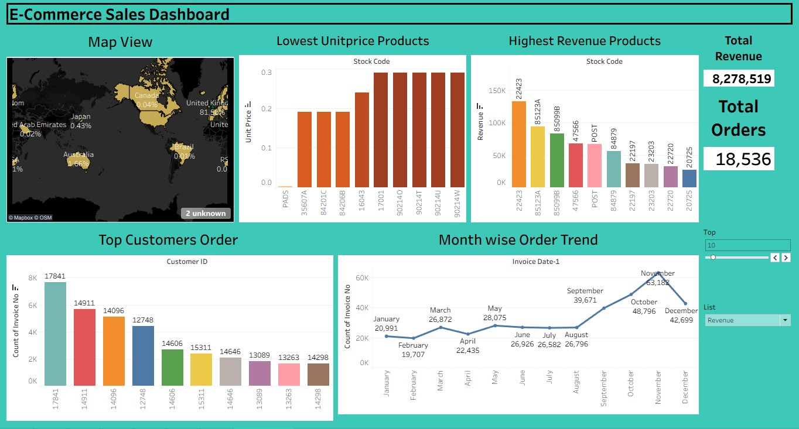

# 📊 Retail Sales & Customer Analytics

## Project Overview

An end-to-end Retail Sales & Customer Analytics project using Python, PostgreSQL, and Tableau to analyze retail transactions and generate meaningful business insights related to sales performance, customers, products, cancellations, and demand trends.

---

## Objectives

- Perform data cleaning and preprocessing
- Analyze sales trends and customer behavior
- Identify top-performing products and countries
- Build an interactive Tableau dashboard
- Generate actionable business insights

---

## Tools & Technologies

- Python
- Pandas
- NumPy
- Matplotlib
- Seaborn
- PostgreSQL
- SQL
- Tableau

## Dataset

The dataset contains retail transaction-level information.

### Dataset Size

Rows: 541,909+
Columns: 8

### Columns

| Column      | Description                  |
| ----------- | ---------------------------- |
| InvoiceNo   | Unique invoice/order number  |
| --------    | ---------------------------  |
| StockCode   | Product identifier           |
| ---------   | ------------------           |
| Description | Product description          |
| ----------  | ----------------------       |
| Quantity    | Number of units purchased    |
| --------    | ---------------------------  |
| InvoiceDate | Date and time of transaction |
| ---------   | ------------------           |
| UnitPrice   | Price per unit               |
| ---------   | ------------------           |
| Country     | Customer's country           |
| ---------   | ------------------           |

## Project Workflow

### 1. Data Cleaning

- Removed missing values
- Removed cancelled transactions
- Handled duplicates
- Created revenue column

### 2. Exploratory Data Analysis (EDA)

- Monthly sales analysis
- Top-selling products
- Country-wise revenue analysis
- Customer behavior analysis

### 3. SQL Analysis

- Business queries using PostgreSQL
- Revenue analysis
- Customer insights
- Product performance analysis

### 4. Dashboard Development

Built an interactive Tableau dashboard including:

- KPI Cards
- Monthly Revenue Trends
- Top Products Analysis
- Country-wise Revenue
- Interactive Filters

---

## Key Business Insights

- United Kingdom generated the highest revenue.
- November recorded the highest monthly sales.
- A small percentage of customers contributed significantly to total revenue.
- Certain products consistently outperformed others in sales.

---

## Dashboard Preview



## Folder Structure

```text
retail-sales-analysis/
│
├── DATA/
├── NOTEBOOKS/
├── SQL/
├── DASHBOARD/
├── README.md
├── requirements.txt
└── .gitignore
```

---

## SQL Queries Included

- Total number of orders
- Total number of customers
- Total products
- Total quantity sold
- Top 10 products by revenue
- Revenue by country
- Average Order Value

---

## Author

Sangita Singha
